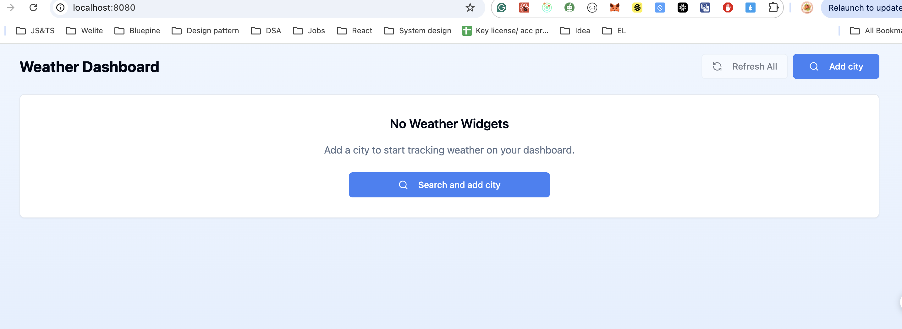
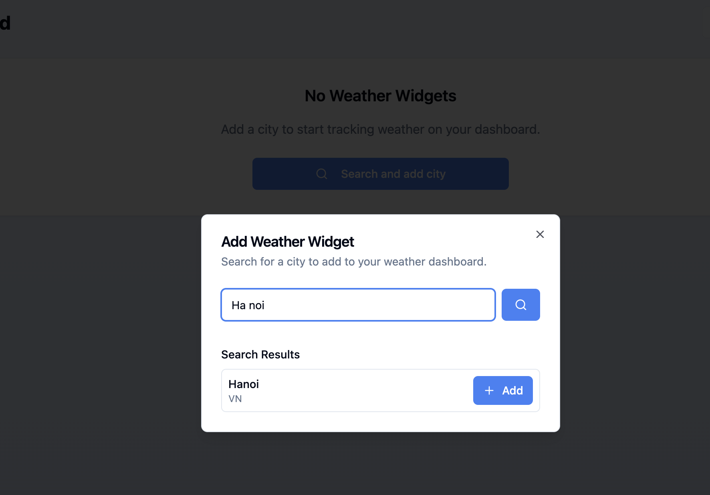
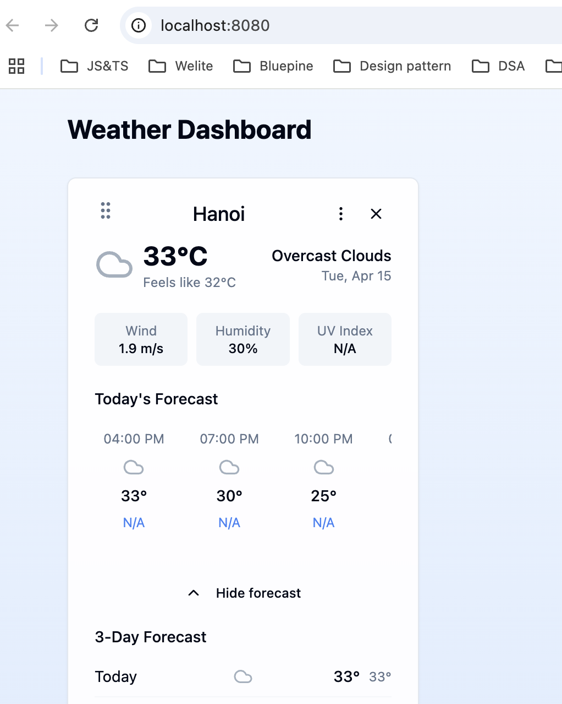
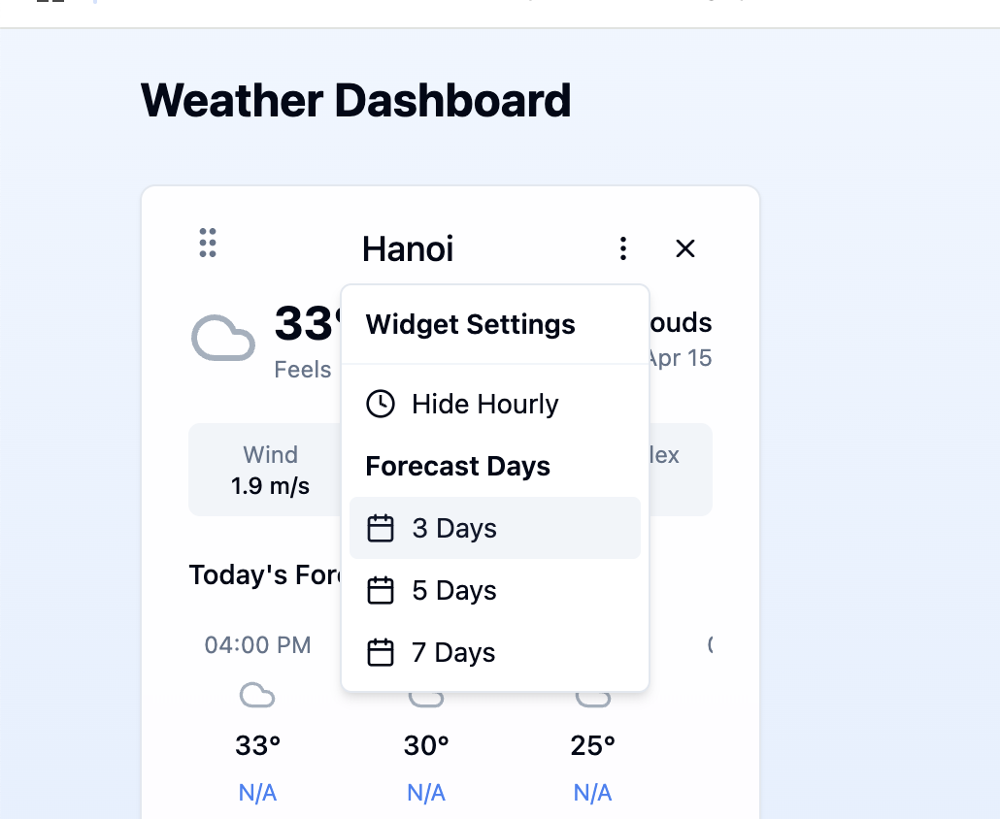
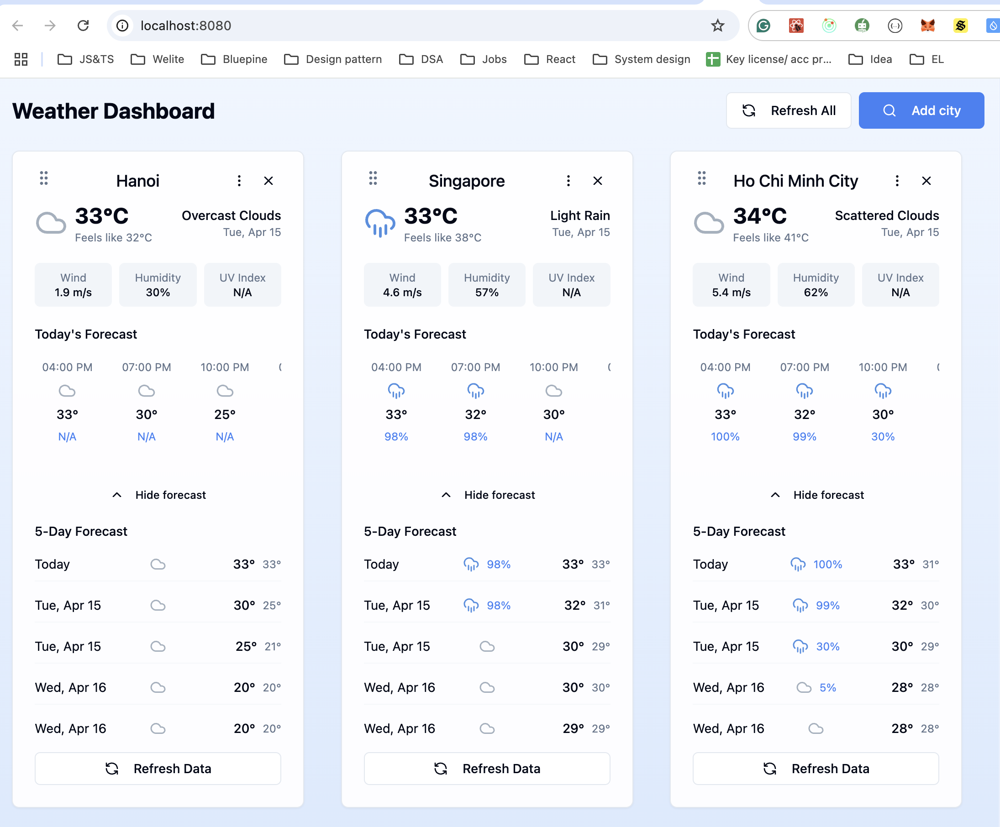
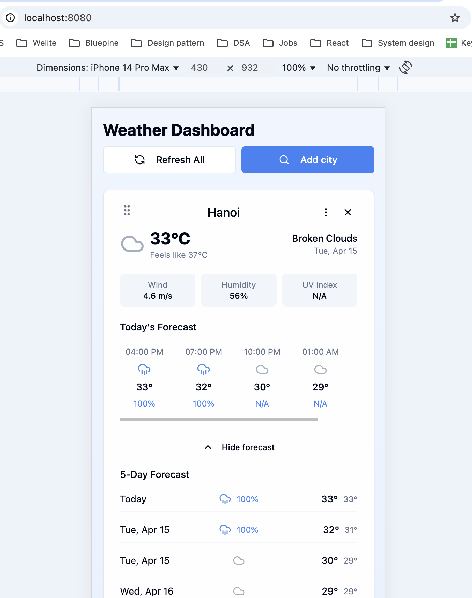
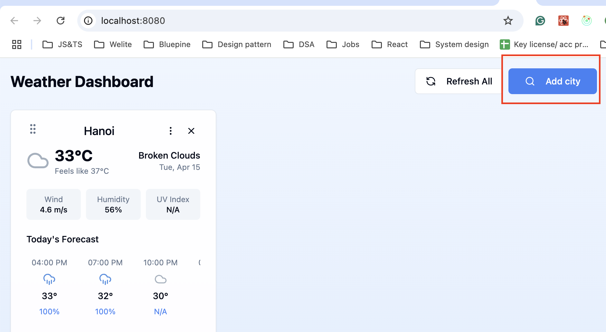
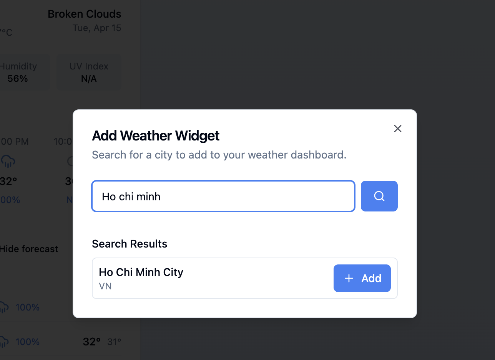
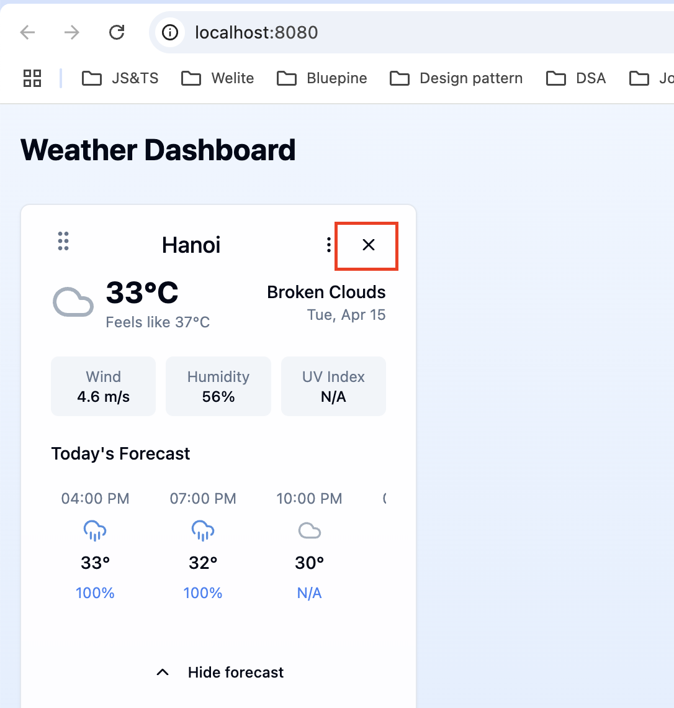
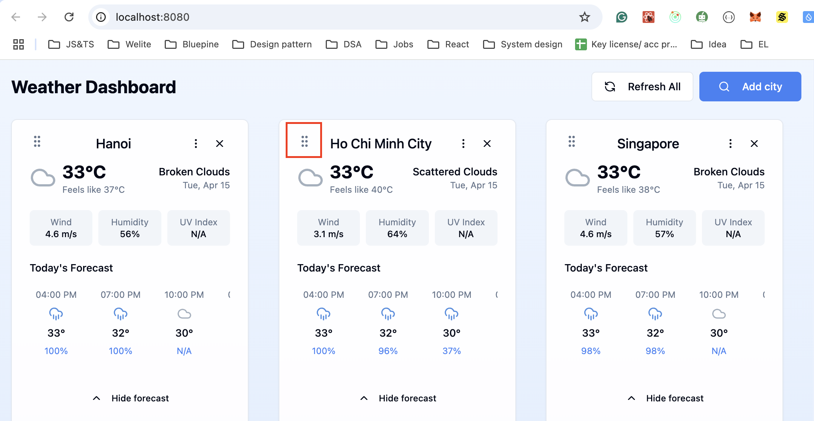

# Welcome to your Weather App

## Project info

**URL**: https://wheather-app-omega-sooty.vercel.app/

## Features:

- Include a search field for the user to enter location.
  
- Display hourly weather forecast for the current day: allow user can scroll horizontally to see the forecast.
  
- Allows the option to show X-day (e.g. 5-day) weather forecast
  
- Have a responsive design and auto re-fresh periodically to get updated data: auto re-fresh periodically 5 minutes.
  - Desktop: 
  - Mobile: 
- Use a weather API of choice (such as open weather map) to fetch the weather data for the location
- Design the UI as a widget-based dashboard.
- Allows adding widget by entering the city name, the widget will show the details of current weather and forecast weather for 1-7 days of that city.
  
- Allows deletion of widgets.
- Allows drag to change the position of the widget on the screen

## How can I setup project?

Follow these steps:

```sh

# Step 1: Install the necessary dependencies.
npm i

# Step 2: Start the development server with auto-reloading and an instant preview.
npm run dev
```

## What technologies are used for this project?

This project is built with:

- Vite
- TypeScript
- React
- shadcn-ui
- Tailwind CSS
- API openweathermap
